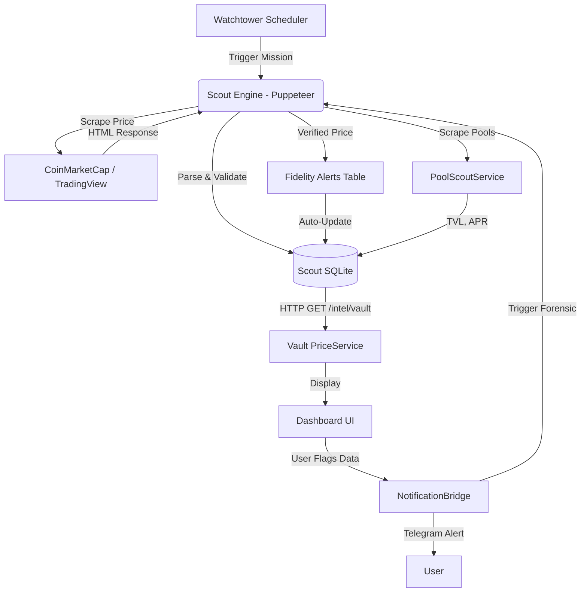

# System Architecture: Digital HQ

**[ARCHITECT speaking]**  
This document provides complete technical documentation of the Digital HQ monorepo, mapping how **The Vault**, **Satellite Scout**, and **The Thinker** operate as a unified investment intelligence ecosystem.

**Version:** 0.1.6  
**Last Audit:** 2026-01-24 (Phase 25)

---

## 🏗️ 1. High-Level Topology: The Tri-Service Model

Digital HQ is a **monorepo** containing three independent services that communicate via REST APIs and shared persistence patterns.

| Service | Role | Core Tech | Port | Status |
|:---|:---|:---|:---|:---|
| **The Vault** | Command Center, Portfolio UI, Transaction Management | React 19, TypeScript 5.3, IndexedDB | 5174 | ✅ Production |
| **Satellite Scout** | Price Scraping, Market Data Extraction | Node.js, Puppeteer, SQLite | 4000 | ✅ Production |
| **The Thinker** | AI Analysis, Multi-Agent Deliberation | Node.js, Gemini 3.0 Flash | 4001 | ✅ Production |

**Critical Design Decision:**  
Each service runs **independently** and can operate offline. The Vault works even if Scout/Thinker are down (uses cached data + external API fallbacks).

---

## 📡 2. Complete Data Flow Architecture

### 2.1 Intelligence Feedback Loop



**Flow Details:**
1. **Watchtower** (`satellite/src/Watchtower.js`) runs every 6 hours, triggers missions from `presets.json`
2. **Scout Engine** (`satellite/scoutEngine.js`) launches Puppeteer, scrapes via CSS selectors
3. **Scout DB** (`scout_intelligence.db`) stores timestamped prices in `intel_records` table
4. **Vault** polls `/intel/vault` every 10 minutes for price updates
5. **User feedback** via Telegram triggers forensic re-scrapes if data looks suspicious

---

### 2.2 Service-to-Service Communication

**The Vault → Scout:**
```
GET  /intel/vault           # Bulk price data for entire portfolio
POST /missions/register     # Auto-register new tokens for tracking
GET  /aliases               # Token symbol → CoinGecko ID mapping
GET  /health/missions       # Scout service health check
```

**The Vault → Thinker:**
```
POST /api/deliberate        # Multi-agent analysis for protocol
GET  /api/alerts/check      # Threshold breach explanations
POST /api/research          # Deep dive research requests
GET  /api/brief/daily       # Morning market summary
```

**Scout → Vault:**
```
WebSocket: ws://localhost:5174/ws   # Real-time price push (future feature)
IPC: window.postMessage()            # Electron desktop bridge
```

---

## 💾 3. Persistence Layer - Complete Stor age Map

### 3.1 The Vault (Frontend) - IndexedDB

**Database:** `investment-tracker`  
**Library:** `idb` (wrapper for IndexedDB API)  
**Location:** Browser's IndexedDB storage (Chrome/Electron have separate databases!)

**Object Stores:**

| Store Name | Key | Purpose | Indexed Fields |
|:---|:---|:---|:---|
| `transactions` | `id` (UUID) | All portfolio transactions | `date`, `assetSymbol`, `type` |
| `assets` | `symbol` | Custom asset definitions (LP tokens) | `symbol` |
| `notes` | `id` | User research notes | `timestamp` |
| `market_picks` | `symbol` | Watchlist / favorites | `addedAt` |
| `scout_cache` | `label` | Cached Scout reports | `timestamp` |
| `backups` | `timestamp` | Auto-backup snapshots | `timestamp` |

**Services Using IndexedDB:**
- `database/TransactionService.ts` - CRUD for transactions
- `database/BackupService.ts` - Auto-snapshots every 24 hours
- `database/OtherServices.ts` - Assets, notes, market picks

---

### 3.2 Scout Satellite - SQLite

**Database:** `satellite/scout_intelligence.db`  
**Library:** `better-sqlite3`  
**Location:** Scout's working directory

**Tables:**

```sql
-- Price telemetry (main data store)
CREATE TABLE intel_records (
    id INTEGER PRIMARY KEY AUTOINCREMENT,
    label TEXT NOT NULL,           -- e.g., "BTC_PRICE", "USDT_DOM"
    value TEXT,                    -- Scraped value
    timestamp INTEGER,             -- Unix timestamp
    confidence REAL DEFAULT 1.0,   -- Data quality score
    source TEXT                    -- URL scraped from
);

-- Fidelity alerts (forensic debugging)
CREATE TABLE fidelity_alerts (
    id INTEGER PRIMARY KEY AUTOINCREMENT,
    label TEXT,
    timestamp INTEGER,
    outlier_value TEXT,
    baseline_value TEXT,
    deviation_pct REAL,
    error_message TEXT
);

-- System configuration
CREATE TABLE system_config (
    key TEXT PRIMARY KEY,
    value TEXT
);

-- Notification settings
CREATE TABLE notification_config (
    key TEXT PRIMARY KEY,
    value TEXT
);
```

**Why SQLite?**
- Faster than IndexedDB for time-series data
- Better query performance for price charts
- Survives browser clears (lives in filesystem)

---

### 3.3 Cloud Vault - Supabase (PostgreSQL)

**Database:** Supabase PostgreSQL instance  
**Table:** `public.user_vaults`  
**Security:** Row Level Security (RLS) policies

```sql
CREATE TABLE public.user_vaults (
    id UUID PRIMARY KEY DEFAULT uuid_generate_v4(),
    user_id UUID NOT NULL REFERENCES auth.users(id),
    encrypted_data TEXT NOT NULL,     -- AES-256 encrypted blob
    last_synced_at TIMESTAMP DEFAULT NOW(),
    created_at TIMESTAMP DEFAULT NOW(),
    CONSTRAINT unique_user UNIQUE (user_id)
);

-- RLS Policy (optimized subquery pattern)
CREATE POLICY "Users can access own vault"
ON public.user_vaults
FOR ALL
USING ((SELECT auth.uid()) = user_id);
```

**Encryption Flow:**
1. User enters sync password (not stored anywhere!)
2. `CloudSyncService.ts` encrypts IndexedDB data with AES-256-GCM
3. Encrypted blob stored in `encrypted_data` column
4. On restore: User re-enters password to decrypt

**Sync Strategy:**
- **Auto-upload:** Every 30 minutes (configurable in Settings)
- **Manual backup:** Export → Download JSON button
- **Restore:** Cloud Vault UI or JSON import

---

## 🏛️ 4. The Vault (React App) - Complete Component Map

### 4.1 Entry Points

**`src/main.tsx`** → Renders `App Wrapper`  
**`src/App.tsx`** → Main router & state orchestrator (338 lines)

**Key Responsibilities:**
- Route management (Dashboard, Analytics, Watchlist, Settings, etc.)
- Global state providers (NotificationContext)
- Auto-sync orchestration (Cloud, Scout, Thinker)
- Transaction form state machine

---

### 4.2 Component Organization ( 53 Components)

```
src/components/
├── Common Components
│   ├── ErrorBoundary.jsx          # Crash handler
│   └── common/                     # Shared UI primitives
│
├── Dashboard (23 components)       # Main portfolio view
│   ├── PortfolioGrid.tsx          # Asset cards
│   ├── PerformanceChart.tsx       # PnL visualization
│   ├── AccountingLedger.tsx       # Cash flow ledger
│   └── [20 more...]
│
├── Transaction Form (9 components)
│   ├── TransactionForm.tsx        # Main form (14.5KB)
│   ├── AssetSelector.tsx
│   ├── LPTokenFields.tsx          # Liquidity pool inputs
│   └── [6 more...]
│
├── Watchlist (5 components)
│   ├── Watchlist.tsx              # Market picks tracker
│   ├── ProtocolCard.tsx
│   └── ResearchPanel.tsx
│
├── Settings (7 components)
│   ├── Settings.tsx               # Main settings hub
│   ├── BackupCenter.tsx           # JSON snapshots
│   ├── CloudSyncModal.tsx         # Supabase UI
│   ├── TelegramConfig.tsx
│   └── [3 more...]
│
└── Layout
    └── Sidebar.tsx                # Navigation
```

---

### 4.3 Custom Hooks (19 Hooks)

**Data Hooks:**
- `useTransactionData.ts` - Main transaction CRUD (loads from IndexedDB)
- `usePortfolio.ts` - Computed portfolio metrics (total value, ROI, etc.)
- `usePriceFeeds.ts` - Scout → Vault price sync
- `useLiquidityPools.ts` - LP token valuation logic
- `useMarketPicks.ts` - Watchlist management

**Sync Hooks:**
- `useCloudSync.ts` - Supabase auto-sync (12.9KB - complex!)
- `useAutoSync.ts` - Scout intelligence sync every 10 min
- `useAutoBackup.ts` - Daily JSON snapshots

**Form Hooks:**
- `useTransactionFormState.ts` - Form field state (12.3KB)
- `useTransactionFormHandlers.ts` - Form submission logic (12.7KB)

**Feature Hooks:**
- `useAlerts.ts` - Threshold monitoring (USDT.D, BTC.D alerts)
- `useDashboardCalculations.ts` - Portfolio math
- `useEarningsCalculations.ts` - APY/ROI calculations
- `useSettings.ts` - User preferences
- `useDataStorage.ts` - Import/export utilities
- `useAppNavigation.ts` - Route helpers
- `useWatchlist.ts` - Watchlist CRUD

---

### 4.4 Service Layer (24 Services!)

**Core Services:**
- `PriceService.ts` (608 lines!) - Multi-source price resolution
  - Scout-first strategy
  - CoinGecko fallback
  - Hyperliquid L1 integration
  - Chart data caching
  
- `DataScoutService.ts` (1136 lines!) - Scout intelligence sync
  - Watchtower protocol
  - Deep research API
  - Protocol tracking
  - Sentiment analysis
  
- `CloudSyncService.ts` - Supabase encryption/sync
- `AccountingService.ts` - Cash flow categorization
- `ExportService.ts` - JSON snapshots (supports legacy backups!)
- `TransactionProcessingService.ts` - Transaction validation

**Intelligence Services:**
- `StrategistIntelligenceService.ts` - AI narrative generation
- `TechnicalAnalysisService.ts` - Price trend analysis
- `GlobalMarketService.ts` - Macro metrics (Total MC, BTC.D, etc.)
- `FearGreedService.ts` - Sentiment index
- `HistoricalPriceService.ts` - OHLC data
- `ForensicService .ts` - Data validation & alerts

**Integration Services:**
- `ScoutSourceService.ts` - Scout API client
- `ExternalScoutService.ts` - Direct CMC/CoinGecko scraping
- `AIGatewayService.ts` - Thinker API client
- `NotificationService.ts` - Telegram bot integration
- `IntelligenceSyncService.ts` - Scout ↔ Vault sync orchestrator
- `SqlAnalystService.ts` - SQL query interface to Scout DB
- `NarrativeService.ts` - Context generation for AI
- `BitcoinAnalogService.ts` - BTC correlation analysis
- `WatchlistServiceLogic.ts` - Watchlist business logic
- `ScoutAliasService.ts` - Symbol → CoinGecko ID resolver
- `CodeHealthService.ts` - Codebase health monitoring
- `PoolScoutService.js` (Satellite) - LP Pool Screener & Metadata
- `DailyBrief.js` (Thinker) - Scheduled market briefings

**Helper Modules:**
- `supabase.ts` - Supabase client init
- `db.ts` - IndexedDB bootstrap

---

## 🛰️ 5. Satellite Scout - The Data Engine

### 5.1 Architecture Overview

**Core Module:** `satellite/scoutEngine.js` (474 lines)  
**Server:** `satellite/server.js` (992 lines!)  
**Mission Config:** `satellite/presets.json` (68+ data points)

**Scout is a headless Puppeteer bot farm** that:
1. Launches Chromium instances
2. Navigates to target URLs (CMC, TradingView, DeFiLlama)
3. Extracts prices via CSS selectors
4. Stores in SQLite with timestamp + confidence score
5. Validates data (outlier detection, "soft 429" detection)
6. Auto-retries on failure

---

### 5.2 Presets Configuration (68+ Missions)

**Format:**
```json
{
  "id": "1767714924227845",
  "label": "BTC_PRICE",
  "url": "https://coinmarketcap.com/currencies/bitcoin/",
  "selector": "[data-test='text-cdp-price-display']",
  "frequency": 80,              // Every 80 watchtower cycles
  "minWait": "3000",            // Min page load wait (ms)
  "maxWait": "64523",           // Max timeout
  "reactionDelay": "2000",      // Post-load delay (human simulation)
  "fallbacks": [...]            // Backup URLs if primary fails
}
```

**Categories Tracked:**
- **Prices:** BTC, ETH, SOL, HYPE, PUMP, USDT, USDC, DAI, etc. (50+ tokens)
- **Dominance:** BTC.D, USDT.D, USDC.D, OTHERS.D
- **TVL:** Ethereum, Hyperliquid, Optimism, Arbitrum, etc.
- **Macro:** Fear & Greed Index, Total Market Cap
- **Yields:** Staking APYs, LP rewards

---

### 5.3 Scout Engine Features

**Stealth Mode:**
- Random user-agent rotation
- Human-like mouse movements
- Variable delays (3-45 seconds)
- Resource blocking (images, stylesheets) for speed
- Browser recycling after 5 missions (prevents memory leaks)

**Fidelity Protection:**
- Outlier detection (flags values >20% different from baseline)
- "Soft 429" pattern detection (CMC sometimes returns "Please wait...")
- Auto-forensics: Re-scrapes suspicious data 3 times
- Fidelity alerts logged to `fidelity_alerts` table

**API Endpoints:**
```
GET  /health                # Service status
GET  /health/missions       # Per-mission health dashboard
GET  /intel/vault           # Bulk price data for Vault
GET  /intel/label/:label    # Single metric by label
POST /missions/register     # Auto-add new token to rotation
GET  /aliases               # Symbol → CoinGecko ID map
PUT  /aliases/:symbol       # Update alias (for LP tokens)
POST /forensic/:label       # Manual forensic re-scrape
```

---

### 5.4 Watchtower Scheduler

**Location:** `satellite/src/Watchtower.js`

**Strategy:**
1. Reads `presets.json`
2. Filters missions by frequency (e.g., `frequency: 2` = every 2 cycles)
3. Queues missions (max 5 parallel tabs)
4. Executes via `scoutEngine.runMission()`
5. Logs results to `intel_records`
6. Sleeps for 6 hours
7. Repeat

**Frequency Examples:**
- `frequency: 80` - High priority (BTC price checked often)
- `frequency: 2` - Medium priority (altcoins, dominance)
- `frequency: 1` - Low priority (TVL metrics)

---

## 🧠 6. The Thinker - AI Analysis Engine

### 6.1 Service Architecture

**Core Modules:**
- `thinker/server.js` (Express server, 7.9KB)
- `thinker/src/ThinkerEngine.js` - Main AI orchestrator
- `thinker/src/DeliberationEngine.js` (10.9KB) - Multi-agent system
- `thinker/src/ThresholdMonitor.js` - Alert correlation
- `thinker/src/ResearchTemplates.js` - Structured analysis
- `thinker/src/DailyBrief.js` - Morning market summary
- `thinker/src/ContextManager.js` - Prompt context builder

---

### 6.2 Multi-Agent Deliberation System

**Endpoint:** `POST /api/deliberate`

**Input:**
```json
{
  "protocol": "Hyperliquid",
  "scoutData": { "tvl": "2.5B", "price": "$30", "volume24h": "$1.2B" }
}
```

**Agent Pipeline:**

1. **Bull Agent** (persona: "Optimistic crypto analyst")
   - Analyzes catalysts, growth potential
   - Outputs: Bullish thesis, upside targets

2. **Bear Agent** (persona: "Skeptical risk analyst")
   - Identifies red flags, vulnerabilities
   - Outputs: Risks, downside scenarios

3. **DeFi Analyst** (persona: "On-chain metrics expert")
   - Evaluates TVL, volume, liquidity, fees
   - Outputs: Protocol health score

4. **Synthesizer** (persona: "Impartial judge")
   - Weighs all 3 perspectives
   - Produces final verdict with confidence (0-100)

**Output:**
```json
{
  "verdict": "BULLISH",
  "confidence": 72,
  "summary": "Strong TVL growth and institutional adoption...",
  "bullishPoints": [...],
  "bearishPoints": [...],
  "verdict": "Strong fundamental momentum but watch for..."
}
```

---

### 6.3 Alert Correlation (Threshold Monitoring)

**Endpoint:** `GET /api/alerts/check?enrich=true`

**Triggers:**
- USDT.D > 5.5% (risk-off signal)
- BTC.D > 65% (altcoin weakness)
- Fear & Greed < 20 (extreme fear)
- Total MC drops >10% in 24h

**AI Enrichment:**
When threshold breached:
1. Fetch full market snapshot from Scout
2. Send to Gemini with "Macro Correlation Analyst" persona
3. Generate explanation: WHY + WHAT TO WATCH

**Example:**
```
🚨 USDT.D Alert: 6.03% (Threshold: 5.5%)

AI Analysis:
"USDT dominance at 6.03% indicates risk-off positioning. 
Capital rotating into stablecoins, not exiting crypto entirely.
BTC holding $95K suggests accumulation phase, not panic.

Watch for: USDT.D breakdown below 5.8% = bullish resumption."
```

---

### 6.4 Research Templates

**Templates Available:**
1. `token_dd` - Token Due Diligence
2. `protocol_health` - Protocol Sustainability Check
3. `macro_correlation` - Market Cycle Positioning

**Template Structure:**
- Sections (Tokenomics, Team, Risks, etc.)
- Ratings (STRONG / MODERATE / WEAK)
- Data points (Market cap, TVL, volume, etc.)
- Verdict paragraph

**Endpoint:** `POST /api/research`

```json
{
  "template": "token_dd",
  "symbol": "HYPE",
  "scoutData": {...}
}
```

**Output:** Markdown report (5-10 paragraphs)

---

## ⚡ 7. Performance & Scalability

### 7.1 Frontend (React)

**Bundle Size:**
- Main chunk: ~800KB (React + Recharts)
- Code-split by route (Dashboard, Analytics, Settings)
- Tailwind CSS: ~50KB (purged)

**Optimization Techniques:**
- `React.memo()` for expensive components
- `useMemo()` for portfolio calculations
- Virtualized lists (`react-window`) for 1000+ transactions
- Debounced search inputs
- Cached Scout data (12-hour expiry)

**Target:** 60 FPS UI, <2s initial load

---

### 7.2 Scout (Puppeteer)

**Memory Management:**
- Node heap: 4096MB (`--max-old-space-size=4096`)
- Browser recycling after 5 missions
- Parallel tab limit: 5 concurrent
- Resource blocking (images, fonts) saves 60% bandwidth

**Scraping Speed:**
- Average mission: 3-7 seconds
- Full 68-mission cycle: ~15 minutes
- Runs every 6 hours (4x/day)

---

### 7.3 Thinker (AI)

**Rate Limits:**
- Gemini 2.0 Flash: 1500 requests/day (free tier)
- Deliberation uses 4 requests (Bull, Bear, DeFi, Synthesizer)
- Daily brief: 1 request
- Alert correlation: 1 request per alert

**Cost Optimization:**
- Use cached Scout data when possible
- Batch multiple questions into single prompt
- Token limit: 32K context window

---

## 🛡️ 8. Security & Privacy

### 8.1 Secrets Management

**Environment Variables (`.env`):**
```bash
VITE_SUPABASE_URL=https://[project].supabase.co
VITE_SUPABASE_ANON_KEY=[anon-key]
TELEGRAM_BOT_TOKEN=[bot-token]
TELEGRAM_CHAT_ID=[chat-id]
GEMINI_API_KEY=[ai-key]
```

**Storage Locations:**
- **Development:** `.env` file (gitignored)
- **Production:** Environment variables (never hardcoded)

**Electron Issue:** Requires `env-loader.js` to load `.env` before Electron initializes (otherwise Supabase URL is undefined)

---

### 8.2 Encryption (Cloud Vault)

**Algorithm:** AES-256-GCM via `crypto.subtle`

**Flow:**
1. User enters sync password in Settings
2. `CloudSyncService` derives encryption key from password (PBKDF2, 100K iterations)
3. IndexedDB data → JSON → AES-256 encrypt → Base64
4. Upload encrypted blob to Supabase
5. Password is NEVER stored (user must remember it!)

**On Restore:**
1. Download encrypted blob from Supabase
2. User re-enters password
3. Derive key → decrypt → parse JSON → write to IndexedDB

---

## 🚀 9. Deployment & Runtime

### 9.1 Development Mode (Recommended)

**Chrome at `localhost:5174`:**
```powershell
# Terminal 1: Vault UI
npm run dev

# Terminal 2: Scout
cd satellite
npm start

# Terminal 3: Thinker (optional)
cd thinker
npm start
```

**Why Chrome?**
- ✅ Cloud Vault works (no CSP issues)
- ✅ Full DevTools
- ✅ Hot reload
- ✅ All Telegram/Scout features work

---

### 9.2 Electron Desktop (Advanced)

**Launch:**
```powershell
npm run start-desktop    # Builds Vite first, then launches Electron
npm run start-hq         # Direct Electron launch (requires Vite running)
```

**Known Issues:**
- ❌ Cloud Vault blocked (Vite CSP headers)
- ❌ Service Worker fails (CSP again)
- ⚠️ Requires `env-loader.js` for Supabase credentials

**Workaround:**
1. Use Chrome to restore from Cloud Vault
2. Export to JSON snapshot
3. Import JSON in Electron

---

### 9.3 Production Build

```powershell
npm run build           # Vite production build → dist/
npm run dist            # Electron packager → H:/DigitalHQ/release/
```

**Build Artifacts:**
- `dist/` - Static files (HTML, JS, CSS)
- `H:/DigitalHQ/release/` - Electron installer (NSIS for Windows)

**What's Included:**
- Vite app (dist folder)
- Electron wrapper
- Satellite Scout (portable Node.js + SQLite)
- Portable Node.js runtime (`portable-node/node.exe`)

---

## 📊 10. Testing Strategy (Planned)

**Current State:**
- ✅ **Unit Tests:** 60+ tests passing (Vitest)
- ❌ **Integration Tests:** No E2E coverage yet
- ✅ **Manual Testing:** Done after each feature

**Test Infrastructure (In Progress):**
- `scripts/seedTestData.ts` - Auto-populate test transactions
- Vitest configured (`npm run test`)
- `@testing-library/react` installed

**Next Steps:**
1. Unit tests for services (PriceService, AccountingService)
2. Hook tests (useTransactionData, usePortfolio)
3. Component tests (TransactionForm, Dashboard)
4. E2E tests with Playwright (Scout→Vault→Thinker flow)

---

## 🔄 11. Key Architectural Patterns

### 11.1 Scout-First Price Resolution

**PriceService Strategy:**
```typescript
async fetchPrice(symbol) {
  // 1. Check Scout local cache (SQLite)
  const scoutPrice = await ScoutSourceService.getPrice(symbol);
  if (scoutPrice) return scoutPrice;
  
  // 2. Check Scout API (http://localhost:4000)
  const liveScout = await fetch('/intel/vault');
  if (liveScout[symbol]) return liveScout[symbol];
  
  // 3. Check Hyperliquid (for HYPE, PUMP, etc.)
  if (isHyperliquidToken(symbol)) {
    return await fetchHyper liquidPrices(symbol);
  }
  
  // 4. Fallback to CoinGecko
  return await fetchCoinGeckoPrice(symbol);
}
```

**Why This Order?**
1. Scout cache = instant (no network)
2. Scout API = most reliable (we control it)
3. Hyperliquid = niche tokens CMC doesn't have
4. CoinGecko = last resort (rate-limited)

---

### 11.2 LP Token Filtering

**Problem:** Liquidity Pool tokens (SUI-USDC LP) aren't tradeable → don't have prices

**Solution:**
```typescript
const LP_PATTERNS = ['LP', 'PRJX', 'SWAP', 'MMT', 'UNI'];

function isTradeable(symbol: string): boolean {
  return !LP_PATTERNS.some(pattern => symbol.includes(pattern));
}
```

**Applied In:**
- `PriceService.ts` - Skips price fetch for LP tokens
- `Scout /missions/register` - Refuses to register LP tokens
- `Dashboard` - Shows LP tokens separately

---

### 11.3 Data Truth Hierarchy

**DataScoutService Priority:**
```
1. Agentic Verification 🥇 (Puppeteer scrape)
2. Live External APIs 🥈 (CoinGecko, CMC)
3. Local Vault Cache 🥉 (IndexedDB scout_cache)
4. Fallback Baseline 🛡️ (Hardcoded defaults)
```

**Why?**
- Agentic = we see the actual rendered price
- APIs = fast but can be stale/wrong
- Cache = offline resilience
- Baseline = prevents total failure

---

## 📖 12. Architectural Decisions Log

### Why IndexedDB over LocalStorage?
- **Capacity:** GB vs 5-10MB
- **Performance:** Indexed queries vs key-value scan
- **Transactions:** ACID compliance
- **Asynchronous:** Doesn't block UI thread

### Why Puppeteer over APIs?
- **No Rate Limits:** We control frequency
- **Niche Tokens:** APIs don't have PUMP, HYPE, etc.
- **Visual Verification:** See what the user sees
- **Forensics:** Can screenshot suspicious data

### Why Supabase over Firebase?
- **Real SQL:** PostgreSQL, not NoSQL
- **RLS:** Row-level security at DB level
- **Open Source:** Can self-host
- **Better auth:** Email + Google + magic links

### Why Chrome over Electron?
- **Cloud Vault:** Vite CSP blocks Supabase in Electron
- **Debugging:** Chrome DevTools > Electron's
- **Speed:** Vite hot-reload instant
- **Simplicity:** No custom build process

### Why Multi-Agent Thinker?
- **Hallucination Reduction:** 3 perspectives balance each other
- **Transparency:** User sees Bull vs Bear arguments
- **Confidence Scores:** Synthesizer weighs strength
- **Spec ialization:** Each agent has expertise

---

## 🎯 13. Future Architecture Improvements

**Current Limitations:**
1. No unit tests → hard to refactor safely
2. Scout runs on single thread → slow full scan
3. No WebSocket → polling instead of push
4. Electron CSP conflict unresolved
5. Manual Thinker requests → no auto-monitoring

**Planned Enhancements:**
1. **Parallel Scout:** Multi-process Puppeteer (5x faster)
2. **WebSocket Push:** Real-time price updates
3. **Vite CSP Fix:** Production build with custom headers
4. **Auto-Thinker:** Daily briefings without manual trigger
5. **Test Suite:** 80%+ coverage goal
6. **Mobile App:** React Native wrapper (future)

---

## 📝 14. Documentation Index

**For Developers:**
- `ARCHITECTURE.md` - This file (system design)
- `CORE_LOGIC_FLOW.md` - Data flow diagrams
- `DECISION_LEDGER.md` - Architecture decision records
- `CONTEXT.md` - AI assistant context file

**For Users:**
- `README.md` - Quick project overview
- `QUICKSTART.md` - Setup guide
- `NAVIGATION.md` - UI feature map

**For Learning:**
- `LEARNING_CURRICULUM.md` - 16-week structured course
- `ROLES.md` - AI agent definitions
- `PROJECT_MEMENTO.md` - Project history

**For Operations:**
- `README_AGENT.md` - Agent development guide
- `.agent/workflows/` - Operational workflows

---

**Last Updated:** 2026-01-14 (Phase 25 - Post-Audit)  
**Maintained By:** Development team + AI assistants  
**Next Review:** After major service updates
