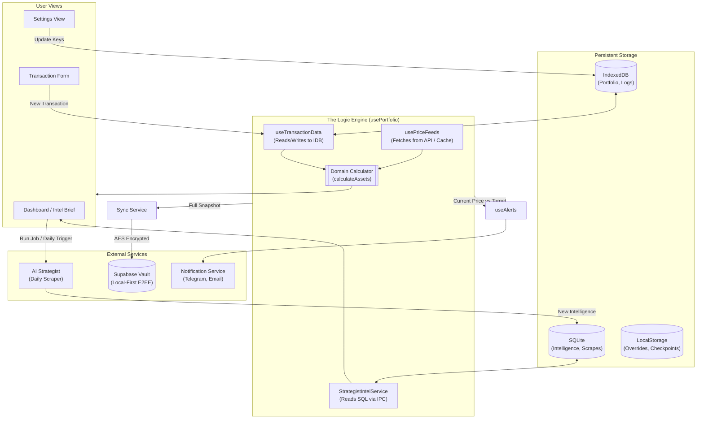

# Core Logic Flow & Architecture

This document outlines how data moves through the application, from user input and external price feeds to the final portfolio calculations and cloud synchronization.

## 1. High-Level Architecture

The application follows a strict **unidirectional data flow**. Raw data and external state are combined by a central "Logic Engine" to produce the derived state shown in the UI.

---

## 2. The Core Logic Pillars

### A. The "Golden Triangle" of Data
The portfolio state is derived in real-time from three specific sources:
1.  **Transactions (Ground Truth)**: Every buy, sell, deposit, and withdrawal stored in the `transactions` IDB table.
2.  **Prices (Reality Check)**: Live prices fetched from external APIs.
3.  **Calculator (Pure Function)**: Located in `src/domain/portfolioCalculator.ts`. It takes the first two items and re-calculates PnL, Value, and LP status instantly. **It never modifies raw data.**

### B. Manual Overrides System
To allow for flexibility without corrupting transaction history, the app uses an "Override Layer":
- When you edit an **Average Buy Price** or set a **Manual Principal**, it is saved to a separate table/storage.
- The `calculateAssets` function checks for these overrides *after* performing its standard math, replacing calculated values with your manual ones where applicable.

### C. The "Zero-Knowledge" Sync (Security)
The application ensures your financial privacy through a "Cloud Vault" pattern:
1.  **Aggregation**: A full backup of all local data is created in JSON format.
2.  **Encryption**: The data is encrypted **on your computer** using your Sync Password (AES-256).
3.  **Transport**: Only the encrypted "blob" is sent to Supabase.
4.  **Privacy**: Neither the developers nor Supabase can see your assets; only someone with your password can decrypt the data.

### D. The Sentinel Loop (Alerts)
The `useAlerts` hook acts as a background monitor:
1.  It watches the shared `prices` object.
2.  It compares current prices against:
    -   **Manual Alerts** (Price > X).
    -   **Watchlist Targets** (Price < Buy Target).
    -   **LP Ranges** (Price > Range Max).
3.  When a condition is met, it triggers the **NotificationService** to route the message to your configured channels (Telegram, Email, or App Toast).

## 3. Data Storage Map

| Storage | Data Types | Syncs to Cloud? |
| :--- | :--- | :--- |
| **SQLite** | Ecosystem Intel, Scrapes, Strategist Narrative | ❌ Local Only |
| **IndexedDB** | Transactions, Logs, Watchlist, Settings, Manual Historic Prices | ✅ Yes |
| **LocalStorage** | Theme, Locale, Dashboard Notes, Alerts Muted, Funding Offset | ✅ Yes |
| **SessionStorage** | Vault PW (Temporary Cache) | ❌ No |

---

## 4. Key Logic Files
- `src/domain/portfolioCalculator.ts`: The "Math" of the app.
- `src/hooks/usePortfolio.ts`: The central orchestrator connecting transactions and prices.
- `src/hooks/useAlerts.ts`: The monitoring logic for price and LP triggers.
- `src/services/db.ts`: The persistence layer (Backup/Restore).
