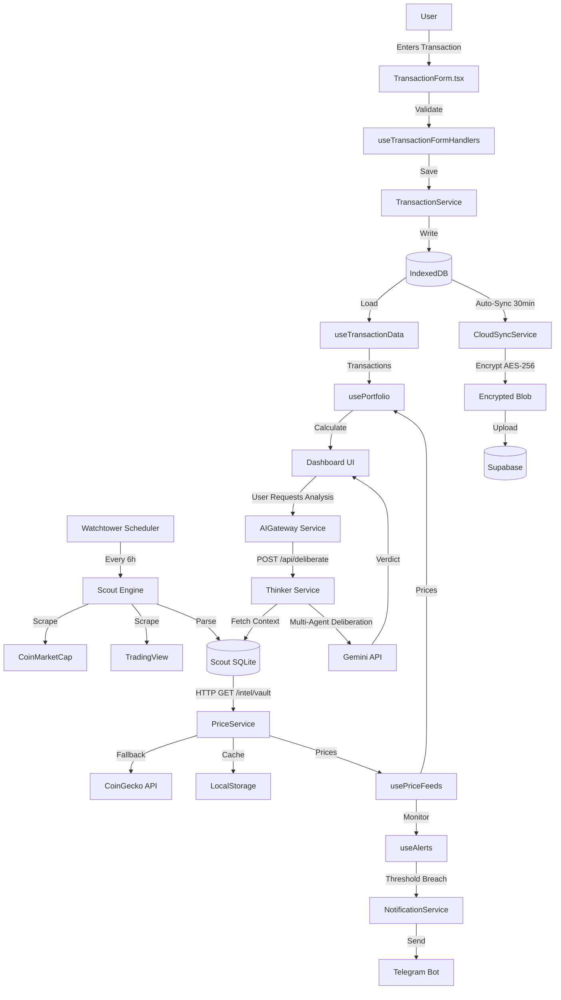
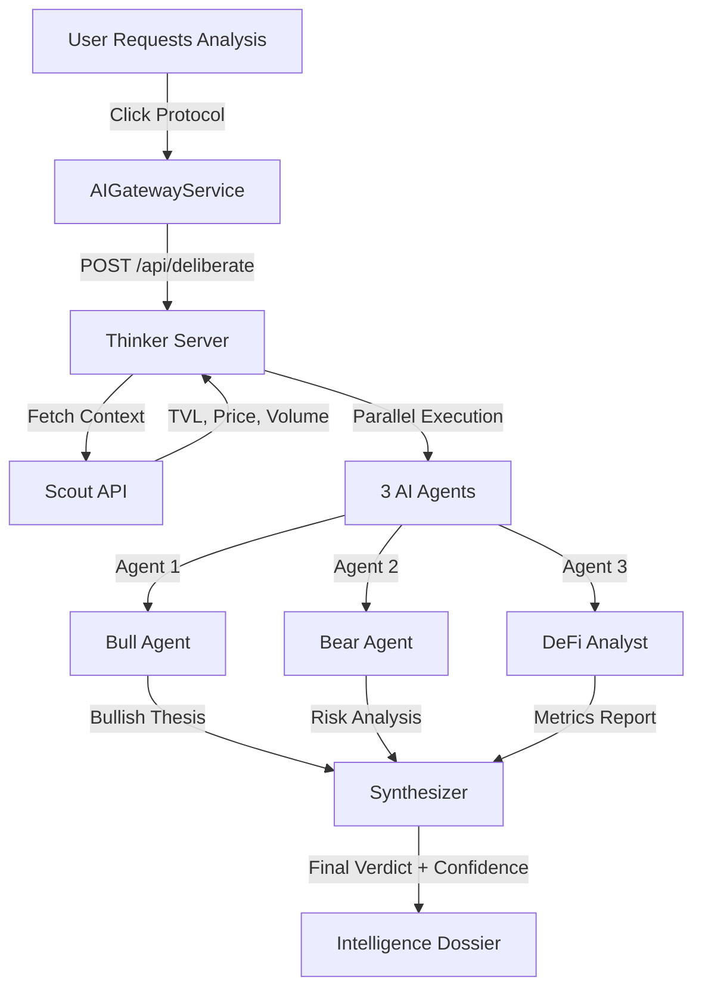

# Core Logic Flow & Architecture

**[ARCHITECT speaking]**  
This document maps how data flows through the Digital HQ ecosystem, from user transactions and Scout scrapes to final portfolio calculations and AI intelligence.

**Last Updated:** 2026-01-24 (Phase 25 - Doc Sync)

---

## 1. System-Wide Data Flow


```mermaid
graph TD
    %% User Input Layer
    U[User] -->|Enters Transaction| TF[TransactionForm.tsx]
    TF -->|Validate| TFH[useTransactionFormHandlers]
    TFH -->|Save| TS[TransactionService]
    TS -->|Write| IDB[(IndexedDB)]
    
    %% Price Data Flow
    W[Watchtower Scheduler] -->|Every 6h| SE[Scout Engine]
    SE -->|Scrape| CMC[CoinMarketCap]
    SE -->|Scrape| TV[TradingView]
    SE -->|Parse| SQLITE[(Scout SQLite)]
    
    SQLITE -->|HTTP GET /intel/vault| PS[PriceService]
    PS -->|Fallback| CG[CoinGecko API]
    PS -->|Cache| LSC[LocalStorage]
    
    %% Portfolio Calculation
    IDB -->|Load| UTD[useTransactionData]
    PS -->|Prices| UPF[usePriceFeeds]
    UTD -->|Transactions| UPORT[usePortfolio]
    UPF -->|Prices| UPORT
    UPORT -->|Calculate| DASH[Dashboard UI]
    
    %% Intelligence Flow
    DASH -->|User Requests Analysis| AIG[AIGateway Service]
    AIG -->|POST /api/deliberate| THINK[Thinker Service]
    THINK -->|Fetch Context| SQLITE
    THINK -->|Multi-Agent Deliberation| AI[Gemini API]
    AI -->|Verdict| DASH
    
    %% Cloud Sync
    IDB -->|Auto-Sync 30min| CS[CloudSyncService]
    CS -->|Encrypt AES-256| ENC[Encrypted Blob]
    ENC -->|Upload| SUP[(Supabase)]
    
    %% Alerts
    UPF -->|Monitor| UA[useAlerts]
    UA -->|Threshold Breach| NS[NotificationService]
    NS -->|Send| TG[Telegram Bot]
```

---

## 2. Transaction Lifecycle: From Input to Display

### Step 1: User Input
**File:** `src/components/TransactionForm.tsx`

```typescript
// User fills form:
{
  assetSymbol: "HYPE",
  amount: 50,
  type: "DEPOSIT",
  pricePerUnit: 30,
  date: "2024-02-10"
}
```

### Step 2: Validation
**Hook:** `src/hooks/useTransactionFormHandlers.ts`

**Checks:**
- Amount > 0
- Valid date
- Symbol exists
- Price reasonable (not obviously wrong)

### Step 3: Persistence
**Service:** `src/services/database/TransactionService.ts`

```typescript
async add(transaction: Transaction) {
  const db = await initDB();
  transaction.id = crypto.randomUUID();
  transaction.createdAt = Date.now();  // Input timestamp
  await db.put('transactions', transaction);
}
```

**Storage:** IndexedDB → `investment-tracker` database → `transactions` store

### Step 4: State Update
**Hook:** `src/hooks/useTransactionData.ts`

```typescript
// React state updates automatically
setTransactions(prev => [newTx, ...prev]);
```

### Step 5: Portfolio Recalculation
**Hook:** `src/hooks/usePortfolio.ts`

```typescript
// Runs whenever transactions OR prices change
const portfolio = useMemo(() => {
  return transactions.map(tx => ({
    symbol: tx.assetSymbol,
    quantity: tx.amount,
    currentValue: tx.amount * prices[tx.assetSymbol],
    roi: calculateROI(tx, prices)
  }));
}, [transactions, prices]);
```

### Step 6: UI Render
**Component:** `src/components/dashboard/*`

Dashboard displays updated portfolio value, ROI, charts instantly.

---

## 3. Price Data Flow: Scout → Vault

### Flow Diagram

```
Watchtower (Every 6h)
    ↓
Queue Missions from presets.json (68+ targets)
    ↓
Scout Engine (Puppeteer)
    ↓
├─ Launch Chromium (5 parallel tabs)
├─ Navigate to CMC/TradingView
├─ Extract via CSS selector
├─ Validate (outlier detection)
└─ Store in SQLite
    ↓
Scout SQLite (intel_records table)
    ↓
HTTP API: GET /intel/vault
    ↓
Vault PriceService.ts
    ↓
├─ Check Scout first
├─ Fallback to Hyperliquid (HYPE, PUMP)
├─ Fallback to CoinGecko
└─ Cache in LocalStorage (4h expiry)
    ↓
usePriceFeeds hook
    ↓
usePortfolio hook
    ↓
Dashboard UI (live updates)
```

### Price Resolution Strategy (Quad-Tier Escalation)

**File:** `src/services/PriceService.ts` (645 lines)

The system uses a robust fallback mechanism to ensure data continuity:

1.  **🥇 Tier 1: Local Knowledge (Scout DB)**  
    Checks `SCOUT_URL/intel/vault` for locally scraped high-fidelity data.
    
2.  **🥈 Tier 2: Specialized Sources (Exchanges)**  
    Direct API calls to **Hyperliquid**, **Binance**, or **Kraken** for niche/high-volume assets.
    
3.  **🥉 Tier 3: Global Aggregators (CoinGecko)**  
    Standard fallback for general market research and historical data.
    
4.  **🛡️ Tier 4: Local Safety & Cache**  
    LocalStorage cache and hardcoded stablecoin fallbacks (USDT/USDC = $1.00).

---

## 4. Intelligence Sync: DataScout Service

### Background Harvesting

**File:** `src/services/DataScoutService.ts` (1,136 lines!)

**Responsibilities:**
- Fetch Scout reports every 12 hours
- Trigger background Scout missions
- Validate data quality
- Inject forensic corrections
- Track watchlist protocols
- Generate research briefs

**Auto-Sync Flow:**

```
App.tsx (useEffect on mount)
    ↓
IntelligenceSyncService.startAutoSync()
    ↓
DataScoutService.harvestData() [Every 12h]
    ↓
├─ Trigger Scout API: POST /missions/harvest
├─ Fetch dominance (BTC.D, USDT.D)
├─ Fetch sentiment (Fear & Greed)
├─ Fetch TVL metrics (DeFiLlama)
└─ Store in IndexedDB scout_cache
    ↓
usePriceFeeds detects update
    ↓
Dashboard re-renders with fresh data
```

---

## 5. Multi-Agent AI Deliberation

### Thinker Service Flow


```mermaid
graph TD
    USER[User Requests Analysis] -->|Click Protocol| AIG[AIGatewayService]
    AIG -->|POST /api/deliberate| THINK[Thinker Server]
    
    THINK -->|Fetch Context| SCOUT[Scout API]
    SCOUT -->|TVL, Price, Volume| THINK
    
    THINK -->|Parallel Execution| AGENTS[3 AI Agents]
    
    AGENTS -->|Agent 1| BULL[Bull Agent]
    AGENTS -->|Agent 2| BEAR[Bear Agent]
    AGENTS -->|Agent 3| DEFI[DeFi Analyst]
    
    BULL -->|Bullish Thesis| SYN[Synthesizer]
    BEAR -->|Risk Analysis| SYN
    DEFI -->|Metrics Report| SYN
    
    SYN -->|Final Verdict + Confidence| UI[Intelligence Dossier]
```

**File:** `thinker/src/DeliberationEngine.js`

**Process:**
1. **Context Gathering:** Fetch Scout data (TVL, price, volume, sentiment)
2. **Parallel Agents:** Run 3 AI agents concurrently
   - **Bull:** "What's the upside case?"
   - **Bear:** "What are the risks?"
   - **DeFi:** "What do the numbers say?"
3. **Synthesis:** Weigh all perspectives, produce verdict
4. **Confidence:** Score 0-100 based on agent agreement

**Output Example:**
```json
{
  "verdict": "BULLISH",
  "confidence": 72,
  "summary": "Strong TVL growth (+40% MoM) and institutional adoption...",
  "risks": ["Centralization concerns", "Token unlock in Q2"],
  "catalysts": ["L2 launch", "Major CEX listing pending"]
}
```

---

## 6. Cloud Vault Sync (Zero-Knowledge)

### Encryption Flow

```
IndexedDB Data
    ↓
ExportService.generateSnapshot()
    ↓
{
  transactions: [...],
  assets: [...],
  notes: [...],
  settings: {...}
}
    ↓
CloudSyncService.encryptData(data, userPassword)
    ↓
├─ Derive key from password (PBKDF2, 100K iterations)
├─ Encrypt with AES-256-GCM
└─ Encode to Base64
    ↓
Encrypted Blob (unreadable without password)
    ↓
POST to Supabase → user_vaults.encrypted_data
```

**File:** `src/services/CloudSyncService.ts`

**Security Guarantees:**
- Password NEVER stored (not in DB, not in LocalStorage)
- Encryption happens client-side (browser)
- Supabase only sees encrypted blob
- Even developers can't decrypt without user's password

### Restore Flow

```
User Enters Password
    ↓
GET Supabase → encrypted_data
    ↓
CloudSyncService.decryptData(blob, password)
    ↓
Decrypted JSON
    ↓
TransactionService.bulkImport(transactions)
    ↓
IndexedDB Updated
    ↓
Page Reload (React re-reads IndexedDB)
    ↓
Dashboard Shows Restored Data
```

---

## 7. Alert Monitoring System

### Threshold Detection

**File:** `src/hooks/useAlerts.ts` (12.9KB)

**Monitors:**
- **Price Targets:** User-defined buy/sell alerts
- **LP Ranges:** Liquidity pool price out of range
- **Macro Thresholds:** USDT.D > 5.5%, BTC.D > 65%
- **Portfolio Milestones:** Total value crosses $X

**Flow:**

```
usePriceFeeds updates every 10 min
    ↓
useAlerts.checkThresholds() runs
    ↓
For each alert:
  if (current > threshold) {
    NotificationService.send(alert);
  }
    ↓
NotificationService routes to:
  ├─ Telegram (if configured)
  ├─ Email (if configured)
  └─ Toast notification (always)
```

**Example Alert:**
```
🚨 USDT Dominance Alert
Current: 6.03% (Threshold: 5.5%)

AI Analysis:
"Capital rotating into stablecoins = risk-off. 
BTC holding $95K = accumulation, not panic.
Watch USDT.D < 5.8% for bullish resumption."
```

---

## 8. LP Token Valuation Logic

### Problem
Liquidity Pool tokens (e.g., "SUI-USDC LP") don't have tradeable prices.

### Solution
**File:** `src/hooks/useLiquidityPools.ts`

**Decomposition:**
```typescript
function decomposeLP(lpSymbol: string) {
  // "SUI-USDC LP" → ["SUI", "USDC"]
  const parts = lpSymbol.split(/[-\s]/);
  return parts.filter(p => p !== "LP");
}
```

**Valuation:**
```typescript
async calculateLPValue(lpToken: Transaction) {
  const [asset1, asset2] = decomposeLP(lpToken.assetSymbol);
  
  // Get prices for underlying assets
  const price1 = await PriceService.fetchPrice(asset1);
  const price2 = await PriceService.fetchPrice(asset2);
  
  // LP value = (initial investment * current ratio)
  // Simplified: Use initial paymentAmount
  return lpToken.paymentAmount;  // Conservative estimate
}
```

**Range Monitoring:**
```typescript
// LP has lpRange: { min: 2.19, max: 4.19 }
// monitorSymbol: "SUI"
const suiPrice = await PriceService.fetchPrice("SUI");

if (suiPrice > lpRange.max || suiPrice < lpRange.min) {
  alert("⚠️ SUI price out of LP range! Impermanent loss risk.");
}
```

---

## 9. Accounting System (Cash Flow Ledger)

### Transaction Classification

**File:** `src/services/AccountingService.ts`

**Categories:**
- `CAPITAL_FUNDING` - External deposits (new capital)
- `EARNINGS` - Interest, staking rewards, airdrops
- `EXTERNAL_OUTFLOW` - Withdrawals to external wallet
- `INTERNAL_REBALANCING` - Asset swaps (USDC → HYPE)

**Logic:**
```typescript
function categorizeTransaction(tx: Transaction): string {
  if (tx.type === 'DEPOSIT' && !tx.linkedTransactionId) {
    return 'CAPITAL_FUNDING';  // Fresh capital
  }
  
  if (tx.type === 'INTEREST') {
    return 'EARNINGS';  // Yield generated
  }
  
  if (tx.type === 'WITHDRAWAL' && tx.linkedTransactionId) {
    return 'INTERNAL_REBALANCING';  // Swap within portfolio
  }
  
  return 'EXTERNAL_OUTFLOW';  // Money leaving system
}
```

**Ledger View:**
```
Date       | Category              | In      | Out     | Balance
-----------|-----------------------|---------|---------|----------
2024-01-15 | CAPITAL_FUNDING       | +$5,000 |         | $5,000
2024-01-20 | INTERNAL_REBALANCING  |         | ($500)  | $4,500  (swap)
2024-01-20 | INTERNAL_REBALANCING  | +$500   |         | $5,000  (swap)
2024-02-01 | EARNINGS              | +$120   |         | $5,120
2024-02-10 | EXTERNAL_OUTFLOW      |         | ($1,000)| $4,120
```

---

## 10. Key Logic Files Reference

| File | Lines | Purpose |
|:---|:---|:---|
| `src/services/PriceService.ts` | 608 | Multi-source price resolution |
| `src/services/DataScoutService.ts` | 1,136 | Scout intelligence sync |
| `src/hooks/useTransactionData.ts` | 126 | Transaction CRUD operations |
| `src/hooks/usePortfolio.ts` | 172 | Portfolio calculations |
| `src/hooks/useAlerts.ts` | 432 | Threshold monitoring |
| `src/hooks/usePriceFeeds.ts` | 322 | Price sync orchestration |
| `src/services/CloudSyncService.ts` | 196 | Encrypted cloud backup |
| `src/services/AccountingService.ts` | 272 | Cash flow categorization |
| `satellite/scoutEngine.js` | 474 | Puppeteer scraper engine |
| `satellite/server.js` | 992 | Scout API + mission orchestrator |
| `thinker/src/DeliberationEngine.js` | 365 | Multi-agent AI system |
| `thinker/src/DailyBrief.js` | 420 | Morning/Evening market summaries |
| `satellite/src/PoolScoutService.js` | 380 | LP Pool Screener (ETH/SOL/SUI) |

---

## 11. Storage Layer Details

### IndexedDB Schema

**Database:** `investment-tracker`

```typescript
// Object Stores:
transactions: {
  keyPath: 'id',           // UUID
  indexes: ['date', 'assetSymbol', 'type']
}

assets: {
  keyPath: 'symbol'        // Custom asset definitions
}

notes: {
  keyPath: 'id',           // Research notes
  indexes: ['timestamp']
}

market_picks: {
  keyPath: 'symbol',       // Watchlist
  indexes: ['addedAt']
}

scout_cache: {
  keyPath: 'label',        // Cached Scout reports
  indexes: ['timestamp']
}

backups: {
  keyPath: 'timestamp'     // Auto-snapshots
}
```

### Scout SQLite Schema

**Database:** `satellite/scout_intelligence.db`

```sql
-- Price telemetry
CREATE TABLE intel_records (
    id INTEGER PRIMARY KEY,
    label TEXT,              -- "BTC_PRICE", "USDT_DOM"
    value TEXT,              -- Scraped value
    timestamp INTEGER,       -- Unix timestamp
    confidence REAL,         -- 0.0-1.0
    source TEXT              -- URL scraped from
);

-- Quality monitoring
CREATE TABLE fidelity_alerts (
    id INTEGER PRIMARY KEY,
    label TEXT,
    outlier_value TEXT,      -- Suspicious value caught
    baseline_value TEXT,     -- Expected value
    deviation_pct REAL,      -- % difference
    timestamp INTEGER
);

-- System config
CREATE TABLE system_config (
    key TEXT PRIMARY KEY,
    value TEXT
);
```

---

## 12. Performance Optimizations

### React Layer
- **Memoization:** `useMemo()` for expensive calculations
- **Virtualization:** `react-window` for 1000+ transaction lists
- **Code Splitting:** Lazy load routes (`React.lazy()`)
- **Debouncing:** Search inputs debounced 300ms

### Data Layer
- **Caching:** Scout prices cached 4 hours
- **Batch Updates:** `bulkImport()` for multiple transactions
- **Indexed Queries:** IndexedDB queries use indexes
- **Pagination:** Load 50 transactions at a time, infinite scroll

### Scout Layer
- **Parallel Scraping:** 5 concurrent Puppeteer tabs
- **Resource Blocking:** Block images/fonts (60% faster)
- **Browser Recycling:** Restart after 5 missions (prevent memory leaks)
- **Smart Scheduling:** High-priority tokens (BTC) checked more often

---

## 13. Error Handling & Resilience

### Price Service Fallbacks
```typescript
try {
  return await fetchScoutPrice(symbol);
} catch (scoutError) {
  try {
    return await fetchCoinGeckoPrice(symbol);
  } catch (cgError) {
    // Return cached price if available
    return getCachedPrice(symbol) ?? null;
  }
}
```

### Scout Engine Retries
```typescript
let retries = 3;
while (retries > 0) {
  try {
    return await scrapePage(url);
  } catch (error) {
    retries--;
    if (retries === 0) {
      logFidelityAlert(error);
      return null;
    }
    await sleep(5000);  // Wait 5s before retry
  }
}
```

### Cloud Sync Conflict Resolution
```typescript
// If cloud version newer than local → user chooses
if (cloudTimestamp > localTimestamp) {
  const choice = confirm("Cloud data is newer. Overwrite local?");
  if (choice) {
    await restoreFromCloud();
  }
}
```

---

## 14. Data Truth Hierarchy

**Priority Order:**
1. **🥇 Agentic Verification** (Puppeteer scrape) - Most reliable
2. **🥈 Live External APIs** (CoinGecko, CMC) - Fast but can be stale
3. **🥉 Local Vault Cache** (IndexedDB) - Offline resilience
4. **🛡️ Fallback Baseline** (Hardcoded defaults) - Last resort

**Why This Matters:**
- If Scout says BTC = $95,000 but CoinGecko says $94,500 → **Trust Scout**
- Scout literally sees the rendered HTML (what humans see)
- APIs can have delays, wrong data, or be down

---

**Last Updated:** 2026-01-24 (Phase 25)  
**Next Review:** After major service architecture changes
