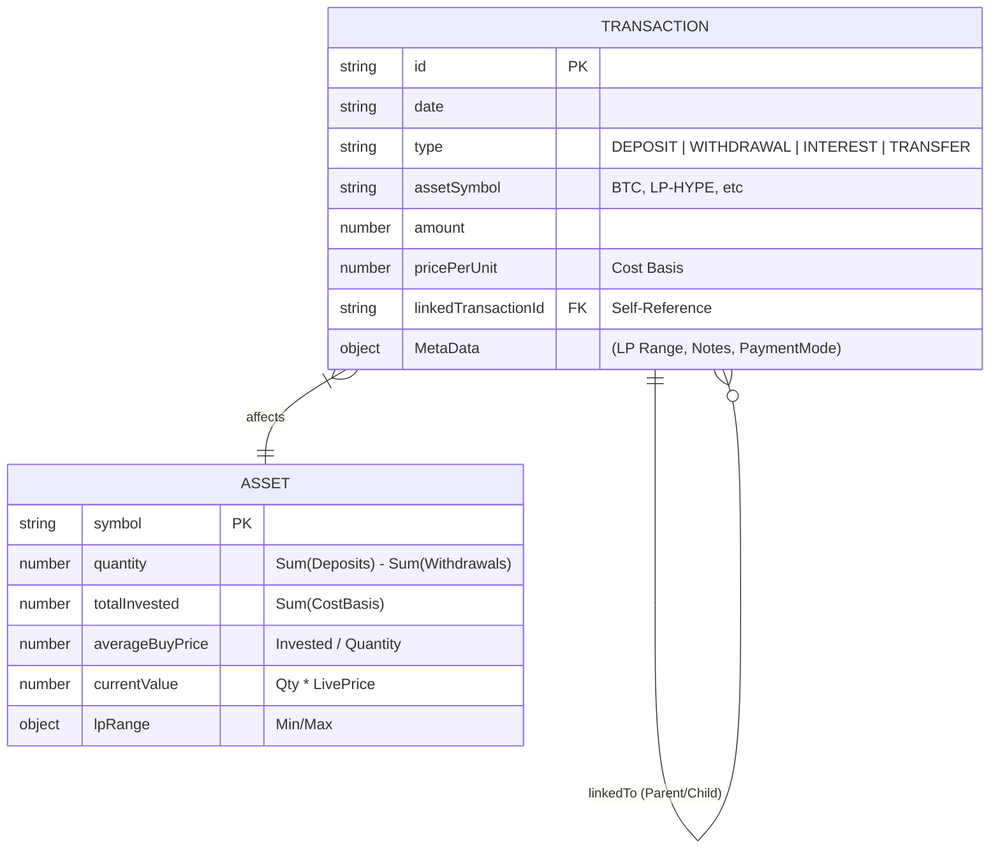
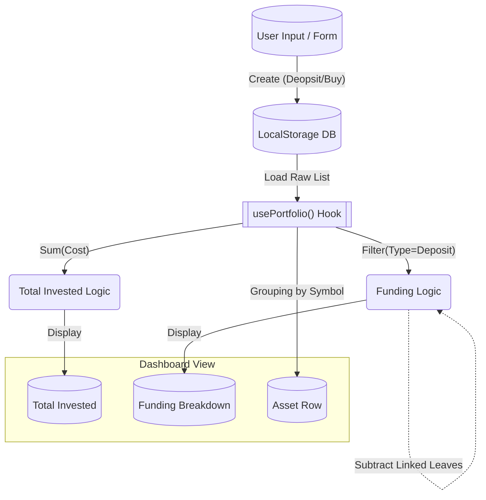
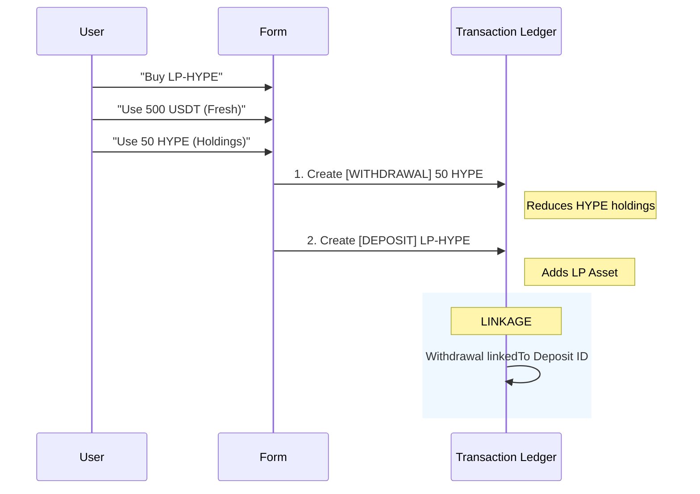

# Data Architecture & Schema Map

## 1. Entity Relationship Diagram (ERD)

This diagram shows how the core "Transactions" relate to each other and how they form the "Assets" you see on the dashboard.

## 2. Transaction Flow "The Engine"

How a raw input becomes a Dashboard Metric.

## 3. The "Mixed Funding" Map (Specific Example)

Visualizing what happens when you "Buy LP with Fresh Cash + Holdings".

